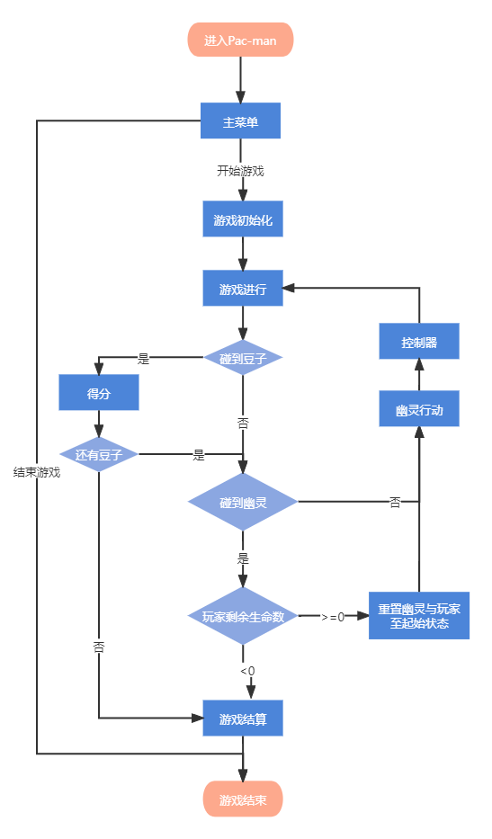

# Pac-man

基于opengl实现吃豆人

参考来自:
[【游戏设计史】《吃豆人》的遗产 Pac-Man | Design Icons](https://www.bilibili.com/video/BV1tE411a7m9?spm_id_from=333.999.0.0)

[C++ 和 OpenGL 实现吃豆人游戏](https://www.lanqiao.cn/courses/1182?utm_source=wechat_session)

实现了游戏基本框架、单个关卡和幽灵行动逻辑。

### 游戏流程

### 幽灵逻辑

行为有两种模式，每个路口根据各自模式与目标进行一次寻路。

##### 追逐模式：

红(Blinky): 向吃豆人当前所在的点移动

粉(Pinky): 向吃豆人前方三格的位置移动

蓝(Lnky): 向与Blinky和吃豆人前方两格的线段再延长相同距离的位置移动

橙(Clyde): 若吃豆人附近6格范围内向左下角移动，否则向吃豆人当前所在点移动

追逐模式一段时间后进入分散模式

##### 分散模式：

各自随机散开到四个角落，分散模式一段时间后进入追逐模式